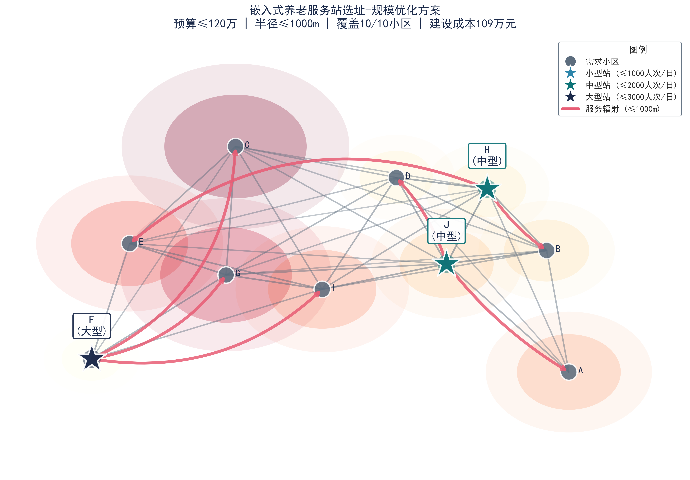
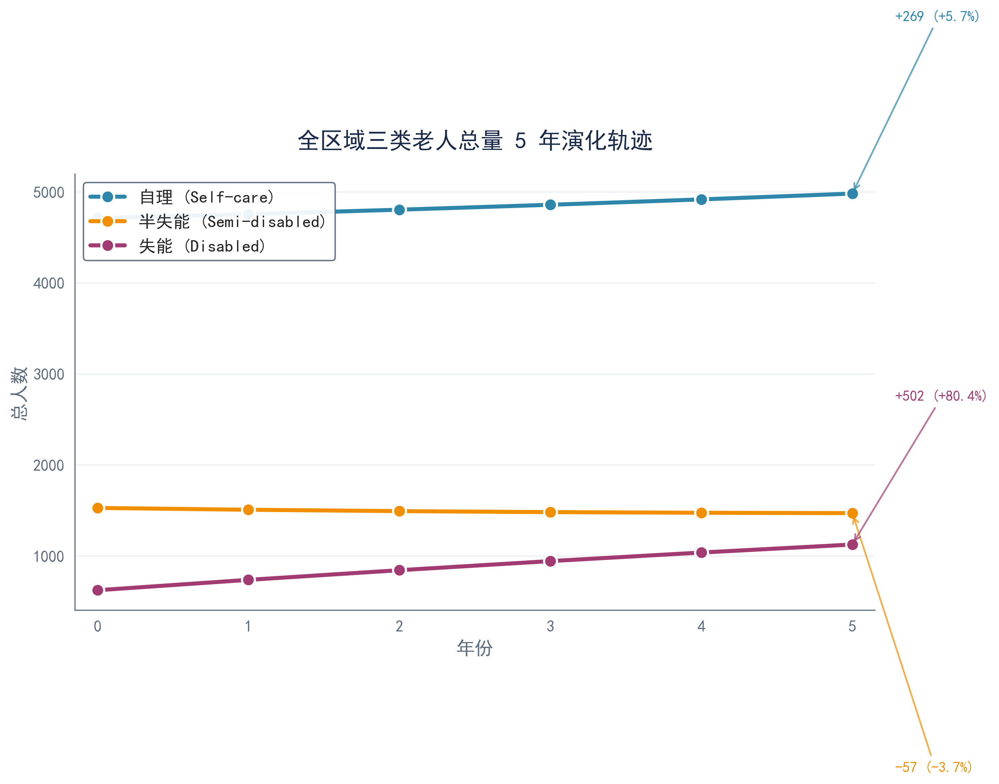
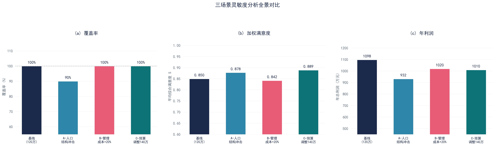
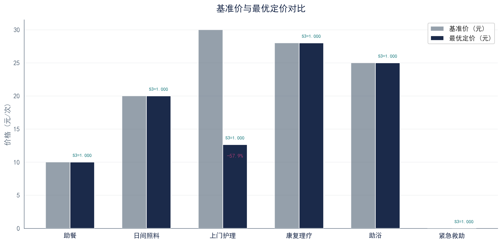

# EECMCM 2026 B题 — 嵌入式社区养老服务站的建设与优化问题

> **竞赛**：中国电机工程学会杯 (电工杯) · 2026 · B题 &emsp;|&emsp; **参赛编号**：014508  
> **命题**：嵌入式社区养老服务站"建在哪、建多大、收多少钱、抗多大风险"的全链条工程决策


---

## 核心成果速览

<p align="center">
  <b>109万元建设成本</b> · <b>10/10小区全覆盖</b> · <b>人均仅159元</b> · <b>年利润1,097.7万元</b>
</p>

| 指标 | 数值 | 指标 | 数值 |
|------|------|------|------|
| 最优方案 | **F(大型) + H(中型) + J(中型)** | 加权满意度 | **0.850** |
| 总建设成本 | **109 万元** (预算120万) | 日总容量 | **7,000 人次** |
| 双模型偏差 | **1.7%** (Markov vs Leslie) | 交叉补贴率 | **14.3%** |
| Q3全S₃ | **1.000** (平价区间) | 韧性最低值 | **ρ = 0.849** (强鲁棒) |

### 最优选址方案

<p align="center">
  
</p>

F站(大型,45万)覆盖C-F-G-I四小区，H站(中型,32万)覆盖B-E-H三小区，J站(中型,32万)覆盖A-D-J三小区。三站利用率92%–96%，呈三足鼎立的空间均衡布局。

### 人口演化轨迹

<p align="center">
  
</p>

失能老人5年暴增**+80.3%**（棘轮效应：$a_{33}=0.95$半吸收壁），半失能净流出−3.7%，自理+5.7%。消费约束使失能全10小区触发需求削减，缺口23.9%–49.1%。

### 鲁棒性全景

<p align="center">
  
</p>

三场景独立MILP重求解。韧性分级：$\rho\ge0.90$高韧 / $0.80\le\rho<0.90$中韧 / $\rho<0.80$脆弱。九维度$\rho>0.80$，零脆弱，系统强鲁棒。

---

## 模型方法

| 问题 | 方法 | 关键技术 |
|------|------|----------|
| **Q1** 人口预测 | 增生型Markov链 + Leslie矩阵互证 | 3状态转移矩阵, 消费约束需求削减, 双模型三角校验 |
| **Q2** 选址优化 | **MILP-MCLP-ES** 混合整数线性规划 | Big-M分段满意度线性化, McCormick包络, CBC分支定界 |
| **Q3** 定价策略 | 词典序MILP + Ramsey-Boiteux定价 | S₃优先→ε=10⁻⁴营收激励, 三层交叉补贴, 利润率≤8% |
| **Q4** 鲁棒性 | 三场景独立MILP重求解 | 韧性矩阵 ρ=1−\|ΔX/X\|, 三级分级(高韧/中韧/脆弱) |

### 定价优化亮点

<p align="center">
  
</p>

上门护理从30元降至12.64元（**−57.9%**），吸收F站8%利润率紧约束，其余5项服务维持基准价。紧急救助公益免费，年净支出47.42万元由营利服务利润331.3万元完全吸收。

---

## 项目结构

```
EECMCM2026/
├── paper_workspace/                  # LaTeX 论文源文件 + 提交产物
│   ├── main_backup.tex               # 论文主文件 (xelatex 三编)
│   ├── 014508B.pdf                   # 参赛论文 (≤20MB)
│   ├── 014508Bshuju.zip              # 支撑材料 (≤20MB)
│   ├── section_1~7_*.tex             # 正文分章节 (10个文件)
│   ├── appendix_code.tex             # 附录 (代码+推导+补充表)
│   └── figures/                      # 论文插图 (14张PNG, 300dpi)
├── code/                             # 核心求解器与图表生成 (9个文件)
│   ├── solve_q1~q4*.py               # Q1–Q4 求解器
│   ├── regenerate_all_figures.py     # 图表总控
│   └── config.py                     # 共享配置
├── utils/                            # 工具脚本 (字体修复/摘要调整)
├── data/                             # 赛题原始数据 (5附件)
├── results/                          # 模型中间输出 (CSV/JSON)
├── references/                       # 参考文献
└── docs/                             # 竞赛论文规范
```

---

## 快速开始

```bash
# 安装依赖
pip install numpy scipy pandas matplotlib openpyxl pulp

# 按 Q1→Q2→Q3→Q4 顺序求解 (数据流串行依赖)
python code/solve_q1.py
python code/solve_q2.py
python code/solve_q3.py
python code/solve_q4_sensitivity.py

# 生成全部论文图表
python code/regenerate_all_figures.py

# 编译论文
cd paper_workspace
xelatex main_backup.tex && xelatex main_backup.tex && xelatex main_backup.tex
```

---

## 提交文件

| 文件 | 大小 | 说明 |
|------|------|------|
| `paper_workspace/014508B.pdf` | 3.1 MB | 参赛论文 (73页, 正文25页) |
| `paper_workspace/014508Bshuju.zip` | 3.8 MB | 支撑材料 (代码+数据+结果+图表+LaTeX) |

---

<p align="center">
  <sub>Methodology: Markov Chain · MILP-MCLP-ES · Big-M Linearization · McCormick Envelope · Lexicographic MILP · Ramsey-Boiteux Pricing</sub>
</p>
